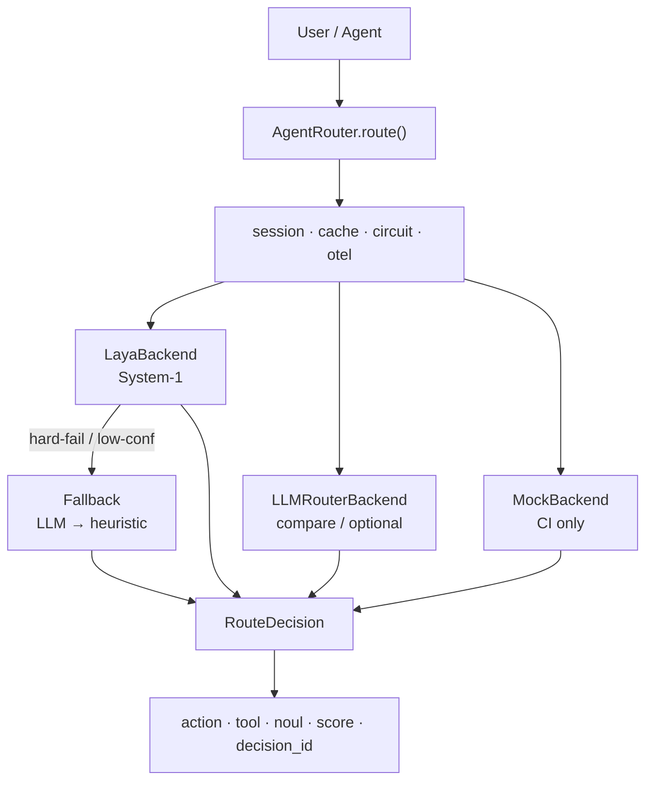

<div align="center">

# Thalamus

**System-1 decision middleware for AI Agents**  
Powered by [Laya](https://github.com/NandhaKishorM/laya) · Fast local routing · LLM fallback when unsure

[English](#thalamus) · [中文](README.zh-CN.md)

[](https://www.python.org/downloads/)
[](LICENSE)
[](.github/workflows/ci.yml)
[](https://pypi.org/project/laya-thalamus/)

</div>

---

**Thalamus** (named after the brain’s fast sensory relay) pulls *which tool / is info enough / can I trust the result* out of the LLM loop — local System-1 for the hot path, big models for hard cases.

| | |
|:--|:--|
| **Drop-in** | OpenAI tools · LangChain · custom Agents |
| **Primitives** | `choice` · `noul` · `score` |
| **Production** | Fallback · circuit breaker · cache · idempotency · Prometheus / OTel |

## Install

```bash
pip install "laya-thalamus[laya]"   # recommended: middleware + System-1 engine
```

| Command | What you get | When to use |
|---------|--------------|-------------|
| `pip install "laya-thalamus[laya]"` | Thalamus **+** official [`laya`](https://pypi.org/project/laya/) runtime | Real System-1 routing (`backend=laya`) — **recommended** |
| `pip install laya-thalamus` | Middleware only (`pydantic` / `pyyaml`) | API exploration, `mock` backend, or you already installed `laya` yourself |
| `pip install "laya-thalamus[api]"` | + FastAPI / uvicorn | `thalamus serve` HTTP API |
| `pip install "laya-thalamus[all]"` | Common extras together | Local full stack |

Without the `[laya]` extra you can still `import laya_thalamus`, but `backend=laya` will fail (or fall back to mock) because the System-1 engine package is missing.

```python
from laya_thalamus import AgentRouter
router = AgentRouter()
d = router.route("What is 123 * 456?")
print(d.selected_tool, d.action, d.summary())
```

---

## Benchmarks

Gold set **n=100 × 2** (Chinese + English; JEV-like `state` / `questions` / `answers`; incl. post-tool turns).

Protocol: both models answer the same gold `state` + `questions` (typed decisions). Measured 2026-09-24.

| Lang | Backend | Tool Acc | Noul Acc | Score Acc | Latency |
|------|---------|---------:|---------:|----------:|--------:|
| **zh** | **JEV** (`typesafe/jev-1.13`) | **98%** | 83% | 93% | ~1.27 s |
| zh | Laya (`laya-multilingual`) | 58% | 39% | 25% | **~0.24 s** |
| **en** | **JEV** (`typesafe/jev-1.13`) | **97%** | 66% | 86% | ~1.33 s |
| en | Laya (`laya-multilingual`) | 65% | 79% | 36% | **~0.25 s** |

<details>
<summary><b>How to read these numbers</b></summary>

| Row | Meaning |
|-----|---------|
| **JEV** | OpenRouter Decisions API (`typesafe/jev-1.13`) on gold `state` / `questions`. Stronger tool choice; cloud RTT. |
| **Laya** | Local System-1 (`convaiinnovations/laya-multilingual`), fallback **off**. Lower latency; room to improve on this gold set. |
| **Noul / Score** | Sufficient (`noul`) and credibility band accuracy where gold labels exist. |

Reproduce:

```bash
# needs OPENROUTER_API_KEY for JEV; local [laya] weights for Laya
python eval/compare_jev_laya.py --lang both --out eval/compare_jev_laya_report.json
```

Report: [`eval/compare_jev_laya_report.json`](eval/compare_jev_laya_report.json)

Product-path sweep (Laya ± fallback / mock, no JEV):

```bash
thalamus compare --lang zh --with-fallback --skip-llm
thalamus compare --lang en --with-fallback --skip-llm
```

</details>

> Goal: **System-1 on the hot path**, fallback on edges — not “always beat the cloud decision model”.

---

## Why Thalamus

| Pain | Without | With Thalamus |
|------|---------|---------------|
| Ask a big model every “call a tool?” | Latency + tokens | `choice` in ms–seconds |
| Enough info? Trust the result? | Brittle prompts | `noul` / `score` + thresholds |
| Tool loops / same-tool spam | DIY per stack | `session_id` circuit + `decision_id` |
| OpenAI / LangChain wiring | Hand-roll adapters | `integrations.*` in ~5 lines |
| Timeout half-answers as truth | Silent mis-routes | [POLICY.md](POLICY.md) hard-fail → LLM → heuristic |

---

## Laya vs Thalamus

| | [Laya](https://github.com/NandhaKishorM/laya) | **Thalamus** (`laya-thalamus`) |
|--|--|--|
| Role | System-1 **inference core** | Agent **decision middleware** |
| API | `predict(...)` | `router.route(...)` + HTTP / CLI / adapters |
| Gaps you own | Fallback, circuit, eval | Built-in |
| Fit | Call-site locked | OpenAI · LangChain · custom Session |

Laya is the engine. Thalamus is the steering wheel and seatbelts.

---

## Architecture



Outputs **routing decisions only** — never the final answer text.

---

## Quick start

```bash
pip install "laya-thalamus[laya]"    # middleware + Laya engine (recommended)
# pip install laya-thalamus          # middleware only — no System-1 weights runtime
# pip install "laya-thalamus[api]"   # + HTTP server deps
```

```python
from laya_thalamus import AgentRouter
from laya_thalamus.config import RouterConfig

cfg = RouterConfig()
cfg.model.backend = "laya"       # auto | laya | mock | llm
cfg.model.timeout_ms = 30_000    # raise for local CPU cold start
router = AgentRouter(config=cfg)

d = router.route("What is 123 * 456?", session_id="user-42")
print(d.decision_id, d.selected_tool, d.summary())
```

**Plug into existing stacks**

```python
from laya_thalamus.integrations import (
    AgentSession, LayaToolSelector, route_openai_turn, decision_to_tool_calls,
)

d = route_openai_turn(router, messages, openai_tools, session_id="s1")
calls = decision_to_tool_calls(d)          # None → let the LLM answer

tool = LayaToolSelector(tools=lc_tools).pick(query, intermediate_steps)
d = AgentSession(router).next(query)
```

```bash
thalamus demo --backend mock
thalamus probe-laya --model /path/to/LAYA
thalamus compare --with-fallback --skip-llm
thalamus serve --port 8080                 # needs [api]
```

**Docs:** [API.md](API.md) · [POLICY.md](POLICY.md) · [FEATURES.md](FEATURES.md) · [`examples/`](examples/)

---

## FAQ

<details>
<summary><b>Is this another Agent framework?</b></summary>

No. Decision middleware only: next action is `call_tool` / `answer` / `terminate`.
</details>

<details>
<summary><b>Why “Thalamus”?</b></summary>

The thalamus is the brain’s fast signal relay — this project is that relay for Agent System-1 routing.
</details>

<details>
<summary><b>Why not ask GPT / JEV every time?</b></summary>

JEV hits ~97–98% tool acc on this gold set, but ~1.3 s cloud RTT. Thalamus keeps local System-1 on the hot path (~0.25 s here) and falls back when needed.
</details>

<details>
<summary><b>Why is bare Laya ~58–65%?</b></summary>

Weakest on post-tool “stop calling tools” turns (and some zh search/direct). See category breakdown in [`eval/compare_jev_laya_report.json`](eval/compare_jev_laya_report.json). Enable product fallback for higher accuracy.
</details>

<details>
<summary><b>Is keyword mock a product metric?</b></summary>

No — heuristic for CI / demo only.
</details>

<details>
<summary><b>Relation to the official <code>laya</code> package?</b></summary>

`laya` = model runtime. This repo = engineering middleware via optional extra `[laya]`.
</details>

<details>
<summary><b>Package / import / CLI names?</b></summary>

PyPI `laya-thalamus` · import `laya_thalamus` · CLI `thalamus` / `laya-thalamus`. Core deps: `pydantic` + `pyyaml` only (FastAPI optional).
</details>

---

## Roadmap & contribute

**0.1 shipped** — choice / noul / score · fallback · circuit · session / idempotency / cache · adapters · async · Prometheus / OTel · CI · packaged eval  

**Next** — larger gold set · Redis cache · decision UI · multi-tenant · 1.0 API freeze  

See [CHANGELOG.md](CHANGELOG.md).

1. Read [API.md](API.md) + [POLICY.md](POLICY.md)  
2. `pip install -e ".[dev]"` → `pytest -q`  
3. Keep `eval/traces.zh.json` + `eval/traces.en.json` in sync with `src/laya_thalamus/resources/` (see `eval/README.md`)
4. Don’t break `AgentRouter.route` signatures  

---

## License

[Apache-2.0](LICENSE) · Weights: [Laya](https://github.com/NandhaKishorM/laya) · [laya.convaiinnovations.com](https://laya.convaiinnovations.com/)

<p align="center">
  <a href="https://www.star-history.com/#lcbkmm/laya-thalamus&Date">
    
  </a>
</p>

<p align="center"><i>If Thalamus saved you a pile of routing prompts — give it a star.</i></p>
