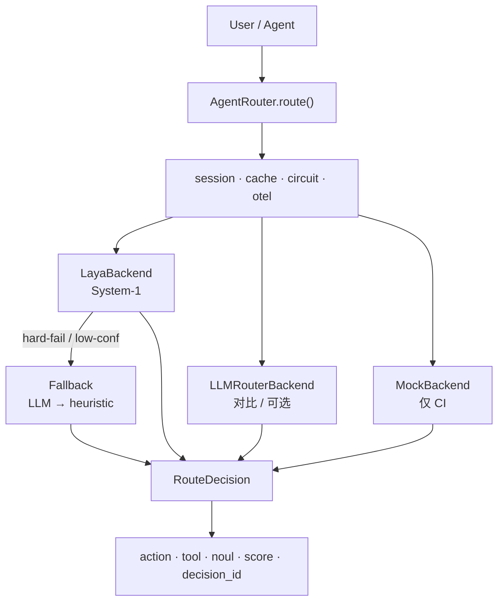

<div align="center">

# Thalamus

**面向 AI Agent 的 System-1 决策中间件**  
基于 [Laya](https://github.com/NandhaKishorM/laya) · 本地快速路由 · 拿不准再降级 LLM

[English](README.md) · [中文](#thalamus)

[](https://www.python.org/downloads/)
[](LICENSE)
[](.github/workflows/ci.yml)
[](https://pypi.org/project/laya-thalamus/)

</div>

---

**Thalamus（丘脑）**：大脑的快速信号中转站。这里把 Agent 里「选哪个工具 / 信息够不够 / 结果信不信」从 LLM 里拆出来——热路径走本地 System-1，难题留给大模型。

| | |
|:--|:--|
| **一行接入** | OpenAI tools · LangChain · 自研 Agent |
| **三种原语** | `choice` · `noul` · `score` |
| **可上线** | 降级 · 熔断 · 缓存 · 幂等 · Prometheus / OTel |

## 安装使用

```bash
pip install "laya-thalamus[laya]"   # 推荐：中间件 + System-1 引擎
```

| 命令 | 装到什么 | 适用场景 |
|------|----------|----------|
| `pip install "laya-thalamus[laya]"` | Thalamus **+** 官方 [`laya`](https://pypi.org/project/laya/) 运行时 | 真 System-1 路由（`backend=laya`）— **推荐** |
| `pip install laya-thalamus` | 仅中间件（`pydantic` / `pyyaml`） | 试 API、`mock` 后端，或你已自行安装 `laya` |
| `pip install "laya-thalamus[api]"` | + FastAPI / uvicorn | `thalamus serve` HTTP 服务 |
| `pip install "laya-thalamus[all]"` | 常用可选依赖一并安装 | 本机完整开发环境 |

不加 `[laya]` 也能 `import laya_thalamus`，但走 `backend=laya` 时会因缺少 System-1 引擎包而失败（或退回 mock）。

```python
from laya_thalamus import AgentRouter
router = AgentRouter()
d = router.route("计算 123 * 456 等于多少")
print(d.selected_tool, d.action, d.summary())
```

---

## 实测评测

人工金标 **中英各 n=100**（JEV 风格 `state` / `questions` / `answers`；含工具后多轮）。

协议：双方回答同一金标 `state` + `questions`（typed decisions）。实测日期 2026-09-24。

| 语言 | Backend | Tool Acc | Noul Acc | Score Acc | 延迟 |
|:----:|:-------:|:--------:|:--------:|:---------:|:----:|
| zh | **JEV** (`typesafe/jev-1.13`) | **98%** | **83%** | **93%** | ~1.27 s |
| zh | Laya (`laya-multilingual`) | 58% | 39% | 25% | **~0.24 s** |
| zh | Laya (`laya` 英文基座) | 49% | 57% | 29% | ~1.47 s |
| en | **JEV** (`typesafe/jev-1.13`) | **97%** | 66% | **86%** | ~1.33 s |
| en | Laya (`laya-multilingual`) | 65% | **79%** | 36% | **~0.25 s** |
| en | Laya (`laya` 英文基座) | 41% | **79%** | 71% | ~0.60 s |

<details>
<summary><b>评测怎么读</b></summary>

| 行 | 含义 |
|----|------|
| **JEV** | OpenRouter Decisions API（`typesafe/jev-1.13`）直接答金标 `state` / `questions`。工具选择更强；含云端 RTT。 |
| **Laya multilingual** | 本地 System-1（`convaiinnovations/laya-multilingual`），**关闭** fallback。本表本地最优折中。 |
| **Laya english** | 英文基座（`convaiinnovations/laya`）。两侧均弱于 multilingual（中文 rag/search 尤差）。 |
| **Noul / Score** | 信息是否足够（`noul`）与可信度分档（有金标时）准确率。 |

复现：

```bash
# JEV 需 OPENROUTER_API_KEY；Laya 需本地 [laya] 权重
python eval/compare_jev_laya.py --lang both --out eval/compare_jev_laya_report.json
python eval/compare_jev_laya.py --lang both --skip-jev --model convaiinnovations/laya \
  --out eval/compare_laya_english_report.json
```

报告：[`compare_jev_laya_report.json`](eval/compare_jev_laya_report.json) · [`compare_laya_english_report.json`](eval/compare_laya_english_report.json)

产品路径扫表（Laya ± fallback / mock，不含 JEV）：

```bash
thalamus compare --lang zh --with-fallback --skip-llm
thalamus compare --lang en --with-fallback --skip-llm
```

</details>

> 目标是 **热路径用 System-1、边缘走 fallback**，不是「永远打败云端决策模型」。

---

## 解决什么痛点

| 痛点 | 没有 Thalamus | 有 Thalamus |
|------|---------------|-------------|
| 每次「要不要调工具」都问大模型 | 延迟高、Token 贵 | `choice` 毫秒～秒级 |
| 信息够不够、结果信不信 | Prompt 硬编码 | `noul` / `score` + 阈值 |
| 工具死循环 / 同工具狂调 | 各框架各写一套 | `session_id` 熔断 + `decision_id` |
| 接 LangChain / OpenAI FC | 自己包装 | `integrations.*` 约五行 |
| 超时半截结果当真理 | 静默错路由 | [POLICY.md](POLICY.md) 硬失败 → LLM → heuristic |

---

## 和原生 Laya

| | [Laya](https://github.com/NandhaKishorM/laya) | **Thalamus** (`laya-thalamus`) |
|--|--|--|
| 定位 | System-1 **推理内核** | Agent **决策中间件** |
| 你拿到的 | `predict(...)` | `router.route(...)` + HTTP / CLI / 适配器 |
| 生产缺口 | 自写降级、熔断、评测 | 开箱即有 |
| 接入 | 绑死调用方式 | OpenAI · LangChain · 自研 Session |

Laya 是引擎；Thalamus 是方向盘和保险杠。

---

## 架构



只输出**路由决策**，不生成最终回答。

---

## 30 秒上手

```bash
pip install "laya-thalamus[laya]"    # 中间件 + Laya 引擎（推荐）
# pip install laya-thalamus          # 仅中间件 — 不含 System-1 权重运行时
# pip install "laya-thalamus[api]"   # + HTTP 服务依赖
```

```python
from laya_thalamus import AgentRouter
from laya_thalamus.config import RouterConfig

cfg = RouterConfig()
cfg.model.backend = "laya"       # auto | laya | mock | llm
cfg.model.timeout_ms = 30_000    # 本地 CPU 冷启动建议加大
router = AgentRouter(config=cfg)

d = router.route("计算 123 * 456 等于多少", session_id="user-42")
print(d.decision_id, d.selected_tool, d.summary())
```

**插进现有栈**

```python
from laya_thalamus.integrations import (
    AgentSession, LayaToolSelector, route_openai_turn, decision_to_tool_calls,
)

d = route_openai_turn(router, messages, openai_tools, session_id="s1")
calls = decision_to_tool_calls(d)          # None → 直接让 LLM 回答

tool = LayaToolSelector(tools=lc_tools).pick(query, intermediate_steps)
d = AgentSession(router).next(query)
```

```bash
thalamus demo --backend mock
thalamus probe-laya --model /path/to/LAYA
thalamus compare --with-fallback --skip-llm
thalamus serve --port 8080                 # 需 [api]
```

**文档：** [API.md](API.md) · [POLICY.md](POLICY.md) · [FEATURES.md](FEATURES.md) · [`examples/`](examples/)

---

## FAQ

<details>
<summary><b>这是又一个 Agent 框架吗？</b></summary>

不是。只做决策中间件：下一步是 `call_tool` / `answer` / `terminate`。
</details>

<details>
<summary><b>为什么叫 Thalamus？</b></summary>

丘脑是大脑的快速信号中转站；本项目做 Agent 的 System-1 路由中转。
</details>

<details>
<summary><b>为什么不每次都问 GPT / JEV？</b></summary>

JEV 在本金标上工具选择约 97–98%，但云端 RTT ~1.3 s。Thalamus 用本地 System-1 扛热路径（此处 ~0.25 s），低置信再降级。
</details>

<details>
<summary><b>为什么裸 Laya 只有约 41–65%？</b></summary>

本地最强是 `laya-multilingual`（zh 58% / en 65%）。英文基座 `laya` 更低（zh 49% / en 41%），弱在「该停工具」多轮与中文 rag/search。产品路径打开 fallback 可再抬准确率。
</details>

<details>
<summary><b>关键词 mock 是产品指标吗？</b></summary>

不是——仅 CI / Demo 启发式。
</details>

<details>
<summary><b>和官方 <code>laya</code> 包什么关系？</b></summary>

`laya` = 模型运行时；本仓库 = 可选 extras `[laya]` 之上的工程化中间件。
</details>

<details>
<summary><b>包名 / import / CLI？</b></summary>

PyPI `laya-thalamus` · import `laya_thalamus` · CLI `thalamus` / `laya-thalamus`。核心依赖只有 `pydantic` + `pyyaml`（FastAPI 可选）。
</details>

---

## 路线图与贡献

**0.1 已交付** — choice / noul / score · 降级 · 熔断 · 会话 / 幂等 / 缓存 · 适配器 · 异步 · Prometheus / OTel · CI · 打包评测  

**下一步** — 更大金标 · Redis 缓存 · 决策可视化 · 多租户 · 1.0 冻结 API  

详见 [CHANGELOG.md](CHANGELOG.md)。

1. 读 [API.md](API.md) + [POLICY.md](POLICY.md)  
2. `pip install -e ".[dev]"` → `pytest -q`  
3. 同步 `eval/traces.zh.json` + `eval/traces.en.json` 与 `src/laya_thalamus/resources/`（见 `eval/README.md`）
4. 不破坏 `AgentRouter.route` 签名  

---

## License

[Apache-2.0](LICENSE) · 权重：[Laya](https://github.com/NandhaKishorM/laya) · [laya.convaiinnovations.com](https://laya.convaiinnovations.com/)

<p align="center">
  <a href="https://www.star-history.com/#lcbkmm/laya-thalamus&Date">
    
  </a>
</p>

<p align="center"><i>如果 Thalamus 帮你少写了一坨路由 Prompt——点个 Star。</i></p>
